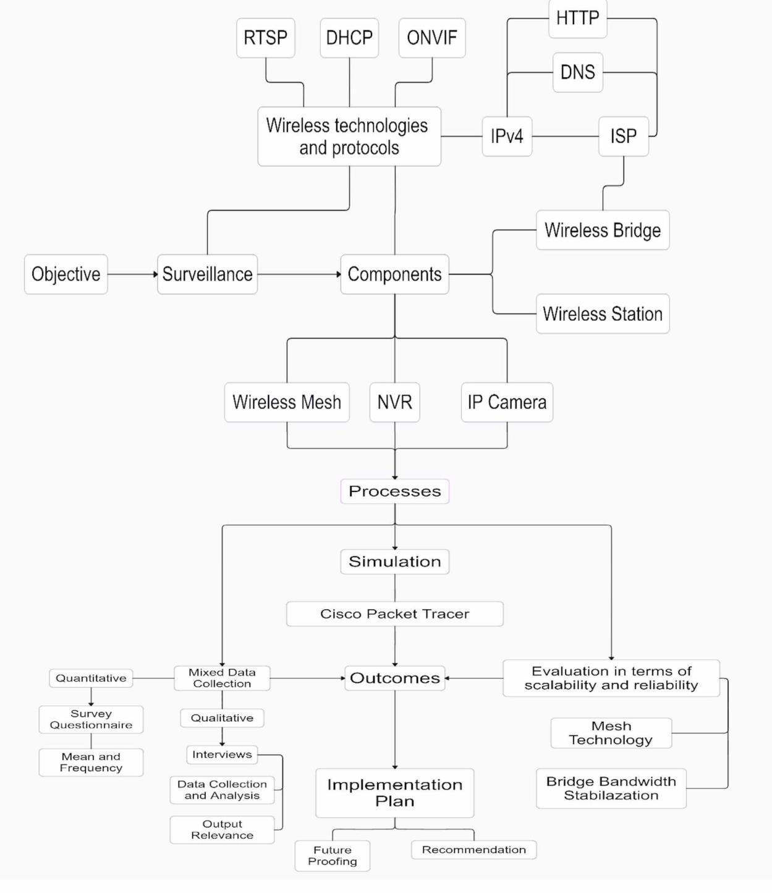
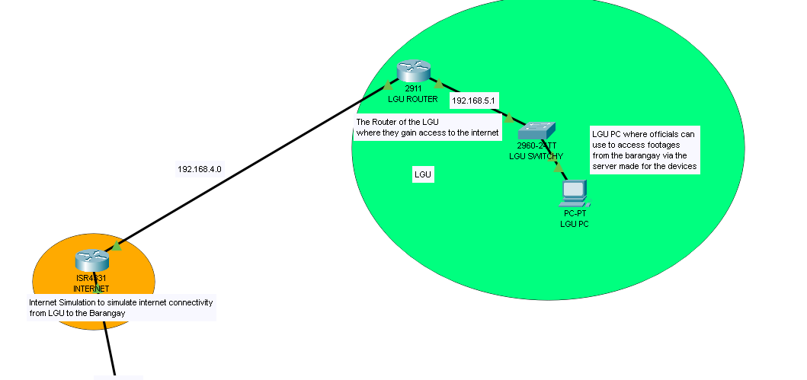

# Architecture

Vigil-Eye is designed as an outdoor IP surveillance network with three functional planes: surveillance capture, wireless transport, and secured operations. The design combines mesh nodes for local wireless resilience with point-to-multipoint wireless bridges for stable longer-distance backhaul.

## Design Objectives

- Modernize a limited analog CCTV environment into an IP-based surveillance system.
- Cover high-priority public areas including roads, intersections, alleyways, dark corners, and community gathering spaces.
- Keep the design feasible for a small local government environment with constrained staffing and budget.
- Make the system scalable enough to add more cameras, nodes, storage, monitoring tools, and remote access controls.
- Preserve reliable recording and evidence retrieval through centralized NVR storage.

## Conceptual Framework

## Logical Topology

The local operations center acts as the hub. The indoor core contains the gateway router, NVR, and monitoring PC. Wireless bridges provide backhaul to farther parts of the area, while mesh nodes extend local wireless coverage and provide alternate data paths between camera zones.

## Functional Layers

| Layer | Function | Notes |
| --- | --- | --- |
| Camera edge | Capture video from bullet and dome IP cameras | Cameras should use static IPs, strong credentials, ONVIF/RTSP, and HTTPS where supported. |
| Mesh access | Connect nearby camera groups | Mesh nodes provide overlapping wireless paths for resilience. |
| Wireless bridge | Extend backhaul links | PtMP bridges reduce dependence on long cable runs and stabilize long-distance links. |
| Core network | Route, segment, secure, and monitor traffic | Gateway handles VLANs, ACLs, VPN, firewall rules, and remote access. |
| Storage and review | Record, retain, and retrieve evidence | NVR centralizes video retention and playback. |
| Operations | Monitor health, alerts, access, and audits | SIEM and monitoring can be added for long-term operations. |

## Proposed Network Segments

| Segment | Purpose | Example Subnet |
| --- | --- | --- |
| Camera VLAN | IP camera traffic | `192.168.1.0/24` |
| Mesh/bridge VLAN | Wireless infrastructure management | `192.168.2.0/24` |
| NVR/core VLAN | NVR and monitoring workstation | `192.168.3.0/24` |
| Partner/VPN VLAN | Inter-site or remote secure access | `192.168.4.0/24` |
| Admin VLAN | Restricted management access | `192.168.5.0/24` |

The original simulation uses static addressing and RIP examples. In a production rollout, OSPF or static routes are cleaner for predictable small networks, while RIP can remain useful for Packet Tracer demonstration.

## Protocol Stack

| Protocol | Role |
| --- | --- |
| TCP/IP | Base network communication. |
| 802.11ac/ax | Wireless access and mesh connectivity. |
| WPA2/WPA3 | Wireless encryption, depending on device support. |
| ONVIF | Cross-vendor surveillance integration. |
| RTSP/RTP | Video stream transport. |
| HTTPS | Secure web management and remote NVR access. |
| VPN/IPsec | Secure inter-site or remote administrator access. |
| SNMP | Network monitoring and device health. |
| VLAN/802.1Q | Traffic segmentation. |
| QoS | Prioritization for real-time video streams. |

## Traffic Flow

1. Cameras capture video and send encoded streams over wireless or wired links.
2. Mesh nodes relay nearby camera traffic toward the core or bridge layer.
3. PtMP bridges carry longer-distance traffic back to the local operations center core.
4. The router enforces segmentation, access control, VPN, and firewall policy.
5. The NVR records streams and exposes playback to authorized users.
6. Monitoring tools collect SNMP, logs, storage status, and camera health alerts.

## Reliability Model

- Mesh nodes create alternate wireless paths when one path degrades.
- PtMP bridges provide stronger backhaul for distance and bandwidth stability.
- Static addressing makes device identity and troubleshooting predictable.
- NVR centralization reduces scattered storage and simplifies evidence retrieval.
- UPS, RAID, and backup storage are recommended before live deployment.
- Dual ISP failover can protect remote viewing and cloud alerting.

## Design Trade-Offs

| Trade-off | Decision |
| --- | --- |
| Cost vs performance | Use reputable midrange devices instead of high-cost enterprise surveillance vendors. |
| Security vs ease of use | Use manageable platforms while enforcing strong credentials, segmentation, and access policy. |
| Wireless flexibility vs RF risk | Use wireless to avoid extensive cabling, but require site surveys, channel planning, and signal testing. |
| Scalability vs complexity | Keep the core simple, then add monitoring, SIEM, and failover once the base design is stable. |
