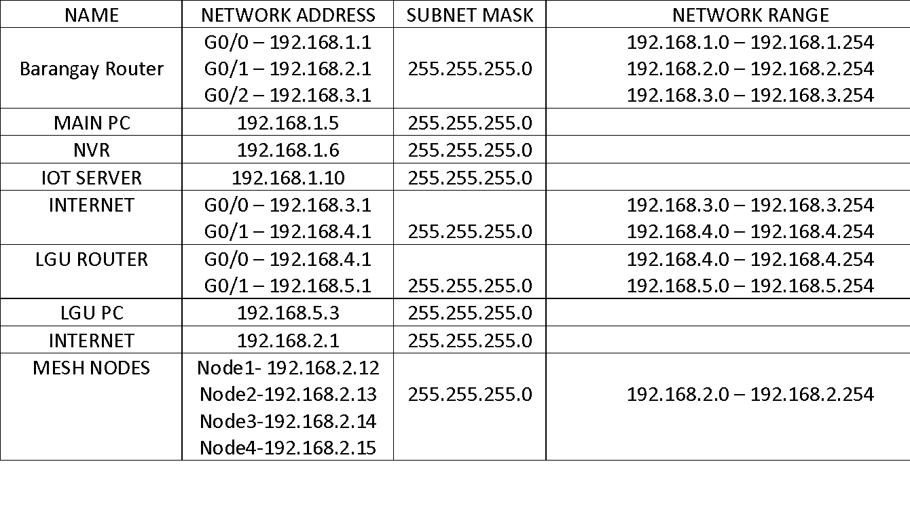

# IP Addressing

The original addressing scheme was provided as a visual table. This page transcribes it into Markdown and adds production notes where the simulation should be cleaned up before deployment.

## Source Address Plan

| Device | Interface Or Role | Address | Subnet Mask | Range |
| --- | --- | --- | --- | --- |
| Site Router | `G0/0` | `192.168.1.1` | `255.255.255.0` | `192.168.1.0 - 192.168.1.254` |
| Site Router | `G0/1` | `192.168.2.1` | `255.255.255.0` | `192.168.2.0 - 192.168.2.254` |
| Site Router | `G0/2` | `192.168.3.1` | `255.255.255.0` | `192.168.3.0 - 192.168.3.254` |
| Main PC | Monitoring workstation | `192.168.1.5` | `255.255.255.0` | Camera/core range |
| NVR | Recorder | `192.168.1.6` | `255.255.255.0` | Camera/core range |
| IoT Server | Simulation server | `192.168.1.10` | `255.255.255.0` | Camera/core range |
| Internet object | `G0/0` | `192.168.3.1` | `255.255.255.0` | `192.168.3.0 - 192.168.3.254` |
| Internet object | `G0/1` | `192.168.4.1` | `255.255.255.0` | `192.168.4.0 - 192.168.4.254` |
| Partner Router | `G0/0` | `192.168.4.1` | `255.255.255.0` | `192.168.4.0 - 192.168.4.254` |
| Partner Router | `G0/1` | `192.168.5.1` | `255.255.255.0` | `192.168.5.0 - 192.168.5.254` |
| Partner PC | Workstation | `192.168.5.3` | `255.255.255.0` | Partner range |
| Internet object | Simulation endpoint | `192.168.2.1` | `255.255.255.0` | Mesh range |
| Mesh Node 1 | Mesh node | `192.168.2.12` | `255.255.255.0` | `192.168.2.0 - 192.168.2.254` |
| Mesh Node 2 | Mesh node | `192.168.2.13` | `255.255.255.0` | `192.168.2.0 - 192.168.2.254` |
| Mesh Node 3 | Mesh node | `192.168.2.14` | `255.255.255.0` | `192.168.2.0 - 192.168.2.254` |
| Mesh Node 4 | Mesh node | `192.168.2.15` | `255.255.255.0` | `192.168.2.0 - 192.168.2.254` |

## Cleanup Before Production

The source visual and router configuration examples contain simulation-style overlaps. Resolve these before field deployment:

- Do not reuse `192.168.3.1` for both Site Router `G0/2` and an internet simulation object.
- Do not reuse `192.168.4.1` for both an internet simulation object and Partner Router `G0/0`.
- Keep the VPN peer address consistent. The example router configs use `192.168.4.2` for the partner peer.
- Move infrastructure management, cameras, NVR, and workstations into separate VLANs where supported.
- Reserve DHCP pools away from static infrastructure addresses.

## Recommended Production Shape

| VLAN | Purpose | Suggested Range |
| --- | --- | --- |
| `10` | Cameras | `192.168.10.0/24` |
| `20` | Mesh and bridge management | `192.168.20.0/24` |
| `30` | NVR and monitoring workstation | `192.168.30.0/24` |
| `40` | VPN or partner interconnect | `192.168.40.0/24` |
| `50` | Admin management | `192.168.50.0/24` |
